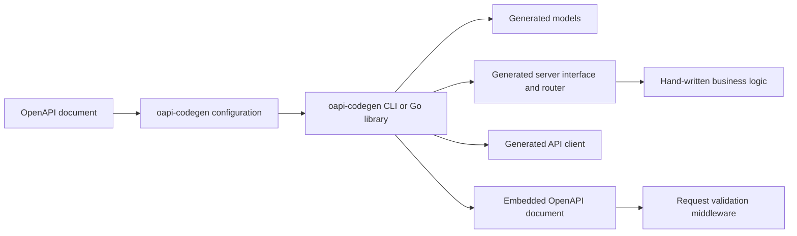
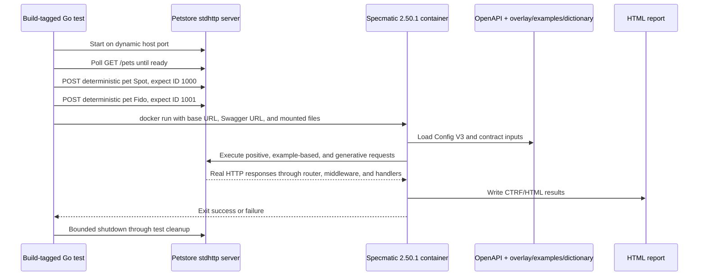
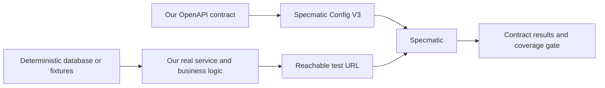

# Specmatic Integration Report: oapi-codegen

**Project:** `oapi-codegen`  
**Integration target:** Petstore Expanded `stdhttp` example  
**Prepared for:** Project and engineering leadership  
**Report date:** 18 July 2026  
**Fork:** <https://github.com/SamirXR/oapi-codegen>  
**Upstream:** <https://github.com/oapi-codegen/oapi-codegen>  
**Specmatic:** [Website](https://specmatic.io/) | [Documentation](https://docs.specmatic.io/)  
**Integrated Specmatic version:** `2.50.1`  
**Document purpose:** Technical implementation report and companion document for the main pull request

---

## 1. Executive Summary

This work adds an opt-in, automated Specmatic contract-test path to the `oapi-codegen` repository. The integration exercises the real Petstore Expanded Go `net/http` server over HTTP and verifies that its externally observable behavior conforms to the OpenAPI contract used to generate its server code.

The integration is intentionally isolated from the normal project test path:

- Existing `make test`, code generation, and library behavior remain independent of Specmatic.
- Specmatic runs only through `make specmatic-test`, the `specmatic` Go build tag, or its dedicated GitHub Actions workflow.
- The Specmatic runtime is a pinned Docker image, `specmatic/specmatic:2.50.1`, so contributors do not need a host-installed Specmatic CLI or Java runtime.
- The test starts the actual Petstore `stdhttp` server, waits for readiness, seeds deterministic state through public HTTP endpoints, runs positive and negative generated scenarios, enforces coverage, and produces an HTML report.
- The latest generated report records **26 tests, 26 passed, 0 failed, and 100% API coverage** across **10 operation/status combinations**.

The checked-in automation is specific to the Petstore demonstration, but the architectural pattern is not. It can test an organization's own HTTP business logic when that service has an OpenAPI contract and can be started with deterministic test data. It verifies API behavior at the service boundary; it does not replace unit, integration, database, queue, security, or internal business-rule tests.

### Management Outcome

| Objective | Result |
|---|---|
| Add contract testing without changing the normal test suite | Achieved through an opt-in Make target and Go build tag |
| Test a real implementation rather than a mock | Achieved; the harness starts `server.NewServer()` and sends real HTTP traffic |
| Make execution reproducible | Achieved through a pinned Docker image and checked-in Config V3 file |
| Include positive and negative API scenarios | Achieved through OpenAPI examples, dictionary data, and schema resiliency tests |
| Enforce measurable API coverage | Achieved with a 100% minimum and zero missed operations |
| Produce reviewable evidence | Achieved through console output and an uploaded HTML report artifact |
| Keep the solution transferable to business services | Achieved as a reusable pattern, with service-specific adaptation required |

---

## 2. What the Original Project Does

`oapi-codegen` is a Go command-line tool and library that converts OpenAPI 3.0 and 3.1 documents into Go code. Its purpose is to remove repetitive API plumbing so developers can focus on business logic.

The project can generate:

- Go model types from OpenAPI schemas.
- Server interfaces and routing boilerplate for supported HTTP frameworks.
- Typed API clients.
- Embedded OpenAPI documents used by applications and validation middleware.
- Strict server interfaces with typed request and response objects.
- Code from specifications split across multiple files and packages.

### 2.1 Original Generation Flow



The important ownership boundary is:

- **Generated code** owns types, interfaces, request/response plumbing, routing adapters, and contract embedding.
- **Application code** owns business decisions, persistence, side effects, and the implementation of generated interfaces.

Specmatic complements this model by testing the combined generated and hand-written HTTP behavior from outside the process.

### 2.2 Petstore Expanded Example

The Petstore Expanded example demonstrates generating equivalent server implementations for several frameworks from one shared OpenAPI contract. Variants include Chi, Gorilla, standard-library `net/http`, Echo, Gin, Fiber, Iris, and a strict server.

Each variant contains:

| Layer | Responsibility |
|---|---|
| `api/server.cfg.yaml` | Selects generated models, server interface, router, and embedded spec |
| `api/generate.go` | Runs `oapi-codegen` through `go generate` |
| `api/petstore-server.gen.go` | Generated models, handlers, router, and embedded contract |
| `server/store.go` | Example in-memory persistence |
| `server/server.go` | Hand-written CRUD behavior |
| `server/setup.go` | Router and OpenAPI validation middleware setup |
| `petstore.go` | Executable entry point |

The shared API exposes four operations:

1. `GET /pets`
2. `POST /pets`
3. `GET /pets/{id}`
4. `DELETE /pets/{id}`

---

## 3. How to Run the Original Project

### 3.1 Prerequisites

- Go `1.25` or newer to build the current repository.
- Git.
- GNU Make for repository convenience targets.
- Platform-specific prerequisites for individual example frameworks.

### 3.2 Clone the Fork

```sh
git clone https://github.com/SamirXR/oapi-codegen.git
cd oapi-codegen
```

To keep the original project available as an upstream remote:

```sh
git remote add upstream https://github.com/oapi-codegen/oapi-codegen.git
git fetch upstream
```

The current local repository uses `origin` for upstream and `fork` for the personal fork. Remote names are local conventions; the URLs are what matter.

### 3.3 Install the CLI

```sh
go install github.com/oapi-codegen/oapi-codegen/v2/cmd/oapi-codegen@latest
oapi-codegen -version
```

The project also recommends managing the tool through Go's tool dependency support:

```sh
go get -tool github.com/oapi-codegen/oapi-codegen/v2/cmd/oapi-codegen@latest
```

### 3.4 Standard Repository Commands

Run these from the repository root:

| Command | Purpose |
|---|---|
| `make test` | Runs tests in the root and child Go modules |
| `make generate` | Regenerates all checked-in generated code |
| `make tidy` | Tidies the root and child Go modules |
| `make lint` | Runs `golangci-lint` across the repository modules |
| `make readme-toc-check` | Validates the generated README table of contents |

The contribution guide requires the following before opening a pull request:

```sh
make tidy
make test
make generate
make lint
```

Generation changes must be reviewed because generated code is committed to the repository.

### 3.5 Run the Petstore Example

Start the standard-library server:

```sh
cd examples/petstore-expanded/stdhttp
go run . --port 8080
```

Run the shared client from another terminal:

```sh
cd examples
go run ./petstore-expanded/common/client/ --port 8080
```

The client exercises create, fetch, missing-record handling, listing/filtering, deletion, and empty-list behavior.

### 3.6 Regenerate One Example

```sh
cd examples/petstore-expanded/stdhttp/api
go generate ./...
```

---

## 4. Why Specmatic Was Added

Generated code compiling successfully does not prove that a running service behaves according to its OpenAPI contract. Drift can occur in hand-written handlers, middleware, response serialization, status codes, content types, validation errors, deployment configuration, or persisted business state.

Specmatic adds an independent check at the HTTP boundary:

1. It reads the OpenAPI contract.
2. It derives valid and invalid requests.
3. It sends those requests to the running application.
4. It verifies response status, headers, and body shape against the contract.
5. It reports covered and missed operations.
6. It fails the build when configured governance criteria are not met.

### 4.1 Problems This Layer Can Detect

- A handler returns a status code not described by the contract.
- A response body does not match its declared schema.
- Validation failures return plain text where JSON is contracted.
- Required fields are accepted when they should be rejected.
- Incorrect types are accepted or produce an invalid error response.
- Path or query parameter handling differs from the contract.
- An operation exists in the contract but is never exercised.
- Runtime routing differs from the OpenAPI document used by clients.

### 4.2 Problems It Does Not Prove Away

- Incorrect calculations that still produce schema-valid data.
- Authorization rules not represented by suitable scenarios or security configuration.
- Database constraints, migrations, transactions, or race conditions.
- Events, queues, scheduled jobs, files, and non-HTTP side effects.
- Performance, load, resilience, and availability requirements.
- Internal branch coverage.
- Whether generated code remains backward compatible as a Go API.

This is why contract tests supplement rather than replace the existing Go test suite.

---

## 5. Implemented Architecture



### 5.1 Isolation Mechanisms

The integration is isolated in three ways:

1. `specmatic_test.go` has the `//go:build specmatic` build constraint.
2. Normal `go test ./...` does not compile or execute the Docker harness.
3. A dedicated workflow runs only when relevant integration or Petstore files change, or when manually dispatched.

### 5.2 Runtime Lifecycle

The Go harness performs the following sequence:

1. Verifies that the Docker executable is available.
2. Creates the real application with `server.NewServer()`.
3. Loads the generated embedded OpenAPI document through `api.GetSpec()`.
4. Adds a test-only `/openapi.json` route around the application handler.
5. Listens on `0.0.0.0` with an operating-system-assigned port to avoid fixed-port conflicts.
6. Starts the HTTP server and captures asynchronous server errors.
7. Registers bounded shutdown and listener cleanup with `t.Cleanup`.
8. Polls `GET /pets` for up to five seconds to establish readiness.
9. Creates two records through `POST /pets` and verifies IDs `1000` and `1001`.
10. Removes any previous Specmatic report directory.
11. Runs the pinned Specmatic container with the service and report environment variables.
12. Streams Specmatic output to the Go test process.
13. Fails the Go test if Specmatic exits unsuccessfully.

### 5.3 Why the Server Is Seeded Through HTTP

The harness does not mutate the in-memory store directly. It uses the public `POST /pets` API because this:

- Exercises the same generated routing, validation, and handler path as a real client.
- Avoids exposing test-only internals from the store.
- Produces deterministic IDs needed by later GET and DELETE examples.
- Keeps production server behavior unchanged.

### 5.4 Why a Dynamic Port Is Used

A dynamic port prevents failures when port `8080` is already in use and allows concurrent test environments. The selected host port is passed to the container through `PETSTORE_BASE_URL` and `PETSTORE_SWAGGER_URL`.

### 5.5 Why Docker Is Used

The Docker approach provides:

- A pinned Specmatic runtime independent of the host machine.
- No host Java, Maven, npm, Homebrew, or Specmatic installation.
- Reproducible local and CI behavior.
- Simple cleanup through `docker run --rm`.

The tradeoff is that contributors need a running Docker daemon and working host/container networking and volume mounts.

---

## 6. Specmatic Configuration

The checked-in `specmatic.yaml` uses Specmatic Config V3.

| Configuration area | Implemented value | Reason |
|---|---|---|
| Contract source | Filesystem directory `..` | Reuses the checked-in Petstore contract |
| Service spec | `petstore-expanded.yaml` | Tests the same API description used by code generation |
| Run mode | OpenAPI `test` | Sends contract-derived traffic to a running service |
| Base URL | `PETSTORE_BASE_URL` | Supports the dynamic test port |
| Swagger URL | `PETSTORE_SWAGGER_URL` | Lets Specmatic compare runtime implementation coverage using the embedded spec |
| Report directory | `SPECMATIC_REPORT_DIR` | Keeps report placement explicit and CI-uploadable |
| Resiliency testing | `schemaResiliencyTests: all` | Generates negative cases for fields, bodies, and parameters |
| Minimum coverage | `100` | Requires every declared operation to be covered |
| Maximum missed operations | `0` | Prevents silent gaps |
| Governance enforcement | `true` | Converts coverage failure into a failing command/CI job |

### 6.1 OpenAPI Overlay

The source contract uses broad `default` error responses. The adjacent overlay gives contract-test scenarios explicit `400` and `404` responses with the shared `Error` schema. This produces meaningful status-specific coverage rather than Specmatic's internal marker for a default response.

The overlay does not add application endpoints. It refines error-response expectations for contract testing.

### 6.2 Dictionary

The dictionary provides stable domain values:

- Pet names: `Spot`, `Fido`, and `Buddy`.
- Pet tags: `dog`, `cat`, and `bird`.
- Path ID: `1000`.

These values reduce random, unusable inputs and align generated scenarios with deterministic seeded state.

### 6.3 External Examples

Two retained examples verify real not-found behavior:

- `GET /pets/9000` expects `404`.
- `DELETE /pets/9001` expects `404`.

Distinct absent IDs prevent tests from depending on execution order. Generated contract tests continue to cover create, list, successful fetch, successful delete, validation failures, and content-type behavior.

---

## 7. Files Added or Changed for the Integration

The table below identifies the current integration-owned surface. It intentionally excludes unrelated upstream commits visible in the branch history.

### 7.1 Primary Integration Files

| File | Change | Purpose and reasoning |
|---|---|---|
| `.github/workflows/specmatic-contract-tests.yml` | Added | Runs the opt-in test in CI, limits permissions, applies a timeout, uploads the report, and verifies a clean tree |
| `Makefile` | Changed | Adds the discoverable `specmatic-test` target while leaving `make test` unchanged |
| `.gitignore` | Changed | Ignores generated build output; see the review note in Section 13 because the current pattern is broader than necessary |
| `examples/petstore-expanded/README.md` | Changed | Documents scope, prerequisites, commands, behavior, report location, reuse, and limitations |
| `examples/petstore-expanded/petstore-expanded_dictionary.yaml` | Added | Supplies deterministic values for generated scenarios |
| `examples/petstore-expanded/petstore-expanded_overlay.yaml` | Added | Makes broad error responses explicit as `400` and `404` for status-specific testing |
| `examples/petstore-expanded/petstore-expanded_examples/get_missing_pet.json` | Added | Verifies deterministic GET-not-found behavior |
| `examples/petstore-expanded/petstore-expanded_examples/delete_missing_pet.json` | Added | Verifies deterministic DELETE-not-found behavior |
| `examples/petstore-expanded/stdhttp/specmatic.yaml` | Added | Defines the pinned integration's Config V3 source, service, run options, generation settings, report, and governance |
| `examples/petstore-expanded/stdhttp/specmatic_test.go` | Added | Owns server lifecycle, readiness, seeding, Docker execution, output, failure propagation, and cleanup |
| `examples/petstore-expanded/stdhttp/server/server_test.go` | Added | Protects the JSON `Error` response required for request-validation failures |
| `examples/petstore-expanded/stdhttp/server/setup.go` | Changed | Configures generated routing and validation middleware to return contract-shaped JSON validation errors |
| `examples/petstore-expanded/stdhttp/server/store.go` | Changed | Returns a non-null empty JSON array (`[]`) for an empty pet list, matching the array response schema |

### 7.2 Contract and Generated-File History

Earlier integration iterations changed `petstore-expanded.yaml` and regenerated server files for multiple frameworks. The final design uses the overlay to hold contract-test-specific explicit errors, reducing the need to alter the shared source contract solely for Specmatic.

Generated files may still appear in historical diffs because this repository commits generated outputs and because the branch includes upstream commits after the local `origin/main` reference. A PR must be reviewed against the current live upstream base, not against a stale local remote-tracking commit.

### 7.3 Files That Are Not Runtime Integration Dependencies

- `examples/petstore-expanded/stdhttp/build/reports/specmatic/**` is generated evidence, not source code.
- `examples/petstore-expanded/backup/**` contains stale sequential examples from an earlier iteration and is not referenced by the active config.
- Other framework variants are not currently run by Specmatic.
- Root generator packages under `pkg/codegen/**` do not invoke Specmatic.
- Neither root nor examples `go.mod` adds a Specmatic dependency; Specmatic runs through Docker.

---

## 8. Commands for the Specmatic Integration

### 8.1 Prerequisites

- Go `1.25+`.
- GNU Make for the convenience target.
- Docker CLI and a running Docker daemon.
- Permission to pull `specmatic/specmatic:2.50.1`.
- On Windows/macOS, Docker Desktop access to the workspace drive/directory.
- Host gateway support for `host.docker.internal`.

No host Specmatic CLI or Java installation is required.

### 8.2 Recommended Command

Run from the repository root:

```sh
make specmatic-test
```

This target executes:

```sh
cd examples/petstore-expanded/stdhttp && go test -tags=specmatic -count=1 -v ./...
```

`-tags=specmatic` includes the opt-in Docker harness. `-count=1` prevents Go's test cache from reusing an earlier result. `-v` exposes server and Specmatic output needed for diagnosis and evidence.

### 8.3 Direct Command

```sh
cd examples/petstore-expanded/stdhttp
go test -tags=specmatic -count=1 -v ./...
```

### 8.4 Important Working-Directory Detail

Do not run `make specmatic-test` from `examples/petstore-expanded/stdhttp` because that directory does not own the root Make target. Either:

- Run `make specmatic-test` from the repository root, or
- Run the direct `go test -tags=specmatic -count=1 -v ./...` command from the `stdhttp` directory.

This explains why a root invocation succeeds while the same Make command from the example directory can fail.

### 8.5 Inspect the Generated Report

After a successful run, open:

```text
examples/petstore-expanded/stdhttp/build/reports/specmatic/test/html/index.html
```

### 8.6 Manual Docker Equivalent

The exact dynamic command is assembled by `specmatic_test.go`; contributors should use the Go test rather than manually reproducing it. Conceptually, it runs:

```sh
docker run --rm \
  --add-host host.docker.internal:host-gateway \
  --volume <petstore-expanded-directory>:/workspace \
  --workdir /workspace/stdhttp \
  --env PETSTORE_BASE_URL=http://host.docker.internal:<dynamic-port> \
  --env PETSTORE_SWAGGER_URL=http://host.docker.internal:<dynamic-port>/openapi.json \
  --env SPECMATIC_REPORT_DIR=/workspace/stdhttp/build/reports/specmatic \
  specmatic/specmatic:2.50.1 \
  test --config specmatic.yaml
```

The real port is chosen by the operating system, so copying this template without the harness is not the supported execution path.

### 8.7 Full Pre-PR Verification

```sh
make specmatic-test
make tidy
make test
make generate
make lint
git diff --check
git status --short
```

The final status check should show only intentional source/documentation changes. Generated reports should not be committed.

---

## 9. CI/CD Behavior

The dedicated workflow runs on:

- Pushes that modify the workflow, Make target, examples module metadata, Petstore contract inputs, or `stdhttp` integration files.
- Pull requests that modify the same paths.
- Manual `workflow_dispatch` execution.

### 9.1 Workflow Controls

| Control | Implementation | Reason |
|---|---|---|
| Minimal permissions | `contents: read` | Applies least privilege |
| Job timeout | 20 minutes | Prevents indefinitely blocked Docker/network runs |
| Pinned actions | Full action commit SHAs | Reduces supply-chain drift |
| Go version | Read from `go.mod` | Keeps CI aligned with the repository |
| Runtime version | `specmatic/specmatic:2.50.1` | Makes test semantics reproducible |
| Report upload | Always, retention seven days | Preserves failure evidence as well as success evidence |
| Artifact presence | `if-no-files-found: error` | Prevents a green workflow with a missing report |
| Clean-tree check | `git diff --exit-code` and empty porcelain status | Detects unplanned generated artifacts or source mutation |

### 9.2 Why the Workflow Is Separate

Docker contract testing is slower and has more environmental dependencies than normal unit tests. A separate, path-filtered workflow:

- Preserves fast feedback for unrelated generator changes.
- Makes the external dependency visible.
- Allows focused retry and artifact review.
- Keeps Specmatic optional for developers working outside the Petstore example.

---

## 10. Verified Test Result

The generated HTML report currently present in the workspace records:

| Metric | Result |
|---|---:|
| Specmatic version | `2.50.1` |
| Total scenarios | 26 |
| Passed | 26 |
| Failed | 0 |
| Skipped | 0 |
| Other/errors | 0 |
| API coverage | 100% |
| Absolute coverage | 100% |
| Covered operation/status combinations | 10 of 10 |

### 10.1 Covered Behavior

| Operation | Covered responses |
|---|---|
| `POST /pets` | `200`, `400` |
| `GET /pets` | `200`, `400` |
| `GET /pets/{id}` | `200`, `400`, `404` |
| `DELETE /pets/{id}` | `204`, `400`, `404` |

Negative generation includes omitted request bodies, null/type mutations in body fields, and invalid path/query parameter types. Positive scenarios cover full and mandatory-only request bodies, list variants, successful retrieval, successful deletion, and explicit not-found examples.

### 10.2 Evidence Interpretation

The result demonstrates that this Petstore process, test data, contract, and Specmatic version were compatible for the recorded run. It is not a permanent guarantee: changes to handlers, middleware, contracts, test data, Docker, or Specmatic can change the result. This is why the workflow reruns on relevant pull requests.

---

## 11. Would It Work on Our Own Business Logic, or Only This Petstore Demo?

### Short Answer

**The committed implementation runs only against the Petstore `stdhttp` example. The same testing pattern works with our own HTTP business logic after service-specific configuration and test setup, but it does not automatically validate every internal code path. It validates business behavior that is reachable through HTTP and represented by the OpenAPI contract and test data.**

### 11.1 Why the Current Automation Is Petstore-Specific

The following values are hard-coded to the example:

- The Make target enters `examples/petstore-expanded/stdhttp`.
- The Go test imports Petstore `api` and `server` packages.
- The harness seeds `NewPet` values and expects IDs `1000` and `1001`.
- Config V3 names the `petstore` service and `petstore-expanded.yaml`.
- The dictionary contains pet names, tags, and a pet ID.
- External examples use Petstore routes and payloads.
- Workflow path filters watch Petstore files.

Therefore, no other generated application is automatically covered by this commit.

### 11.2 Why the Pattern Is Business-Logic Compatible

Specmatic communicates through HTTP. It does not require the application to be Petstore, Go, `net/http`, or even generated by `oapi-codegen`. If an application exposes a reachable API described by OpenAPI, Specmatic can derive requests and validate responses.

For an internal service, the end-to-end path would be:



### 11.3 Required Adaptation for a Business Service

| Area | Required change |
|---|---|
| Contract | Point Config V3 to the service's real OpenAPI document |
| Service startup | Start the application in the test harness, Compose stack, or CI environment |
| Base URL | Pass the reachable service URL to Specmatic |
| Runtime spec URL | Expose or otherwise provide the implementation's effective OpenAPI document if implementation coverage is required |
| Authentication | Supply test credentials through protected CI secrets or test identity infrastructure |
| State | Seed database records through public APIs, migrations, fixtures, or controlled test setup |
| Examples | Add deterministic domain scenarios for workflows random generation cannot satisfy |
| Dictionary | Add valid domain values for IDs, enums, account references, and constrained fields |
| Cleanup | Remove test records or isolate each run in an ephemeral environment |
| Coverage gate | Set realistic initial criteria and raise them deliberately |
| CI paths | Watch that service's contract, implementation, config, and test inputs |

### 11.4 Example Business Scenarios

It would work well for externally observable rules such as:

- Rejecting an order with a missing required field.
- Returning `404` for an unknown account.
- Returning `409` for a duplicate resource when the contract declares that response.
- Enforcing enum, format, range, and nullable constraints.
- Verifying response schemas and content types.
- Ensuring every documented operation has at least one scenario.

It would not, by itself, prove rules such as:

- Correct tax or interest calculations when both correct and incorrect values satisfy the same schema.
- Correct authorization unless identities and expected outcomes are modeled in examples/tests.
- Correct database transaction rollback.
- Correct publication of an event after an HTTP request.
- Correct retry behavior against a downstream service.

Those require assertions or tests at the relevant boundary. Specmatic remains valuable because it verifies the public contract while those tests verify deeper semantics.

### 11.5 Recommended Adoption Strategy for Our Services

1. Select one stable HTTP service with an accurate OpenAPI document.
2. Run Specmatic in non-enforcing mode first to measure current drift.
3. Fix contract/implementation mismatches rather than weakening tests indiscriminately.
4. Add deterministic examples for authenticated and stateful flows.
5. Add a dictionary for constrained business values.
6. Enable an agreed coverage threshold.
7. Make the gate mandatory after the baseline is reliable.
8. Retain unit and integration tests for internal rules and side effects.

---

## 12. Design Decisions and Reasoning

| Decision | Reason | Tradeoff |
|---|---|---|
| Use a Go test as the orchestrator | Reuses repository tooling and can start the in-process server safely | Couples this harness to the Go example |
| Use a build tag | Keeps Docker out of normal tests | Users must remember the tagged command |
| Pin Specmatic `2.50.1` | Reproducible local/CI semantics | Upgrades require an explicit change and retest |
| Use Docker | Avoids host CLI/JDK installation | Requires Docker networking and mounts |
| Use a dynamic port | Avoids port conflicts | Requires environment-driven configuration |
| Seed through public HTTP | Tests real behavior and avoids store internals | Adds setup requests and domain-specific code |
| Use Config V3 in source control | Reviewable, repeatable configuration | Must be maintained with Specmatic upgrades |
| Use examples plus generation | Combines deterministic workflows with broader schema variation | Stateful examples must be designed carefully |
| Enforce 100%/zero missed operations | Prevents silent API coverage regression in this small example | A larger legacy service may need staged thresholds |
| Upload HTML on success or failure | Gives reviewers evidence without reproducing locally | Consumes artifact storage |
| Keep normal tests unchanged | Minimizes impact on contributors and upstream maintainers | Contract tests are not run by every generic test command |
| Avoid Spring Actuator | It is not applicable to this Go server | Runtime coverage uses the embedded OpenAPI route instead |

---

## 13. Risks, Limitations, and Review Notes

### 13.1 Current Review Items

1. **Broad ignore rule:** `.gitignore` currently uses `**/build/`. A narrower rule such as `examples/petstore-expanded/stdhttp/build/reports/specmatic/` would avoid hiding unrelated build directories.
2. **Stale backup examples:** `examples/petstore-expanded/backup/` is not used by the active integration and should be omitted from an upstream PR unless there is a documented purpose.
3. **Branch comparison noise:** the local branch contains upstream commits after the local upstream reference. Refresh the upstream remote and create the PR from a dedicated non-`main` branch so only integration changes are reviewed.
4. **Docker tag integrity:** pinning a version tag is reproducible at the release level, but a digest would provide stronger immutability if upstream policy requires it.
5. **Overlay discovery:** the current run demonstrates that the adjacent overlay is applied, but this convention should be revalidated on every Specmatic upgrade.
6. **Container-to-host networking:** `host.docker.internal` and `host-gateway` work in the intended local/Ubuntu CI environments but should be tested on any additional runner platform.

### 13.2 Security Considerations

- The test service binds to `0.0.0.0` so the container can reach it. It uses a dynamic port and exists only for the test lifetime, but local firewall policy still applies.
- The workflow uses read-only repository permissions.
- No credentials are currently needed for Petstore.
- A business integration must pass credentials through CI secrets and must never commit tokens, passwords, or customer data in examples/dictionaries.
- Test examples should use synthetic data and isolated environments.
- Docker image provenance and update policy should be reviewed periodically.

### 13.3 Operational Limitations

- The integration requires network access to pull the image on a cold machine.
- Report generation consumes disk space.
- Stateful tests can become order-dependent unless each scenario uses isolated or deterministic data.
- A stale OpenAPI contract can make a conforming test meaningless; contract ownership remains essential.

---

## 14. Pull Request Companion Document

This section is intended to accompany the main PR description. It follows the repository's preference for focused, opt-in changes and explicit verification.

### Proposed PR Title

```text
test(examples): add opt-in Specmatic contract tests for Petstore stdhttp
```

### Proposed PR Description

```markdown
## Summary

Add an opt-in Specmatic contract-test path for the Petstore Expanded `stdhttp`
example. The harness starts the real Go server, seeds deterministic state through
the public API, runs Specmatic 2.50.1 from Docker, enforces complete operation
coverage, and publishes an HTML report in a dedicated path-filtered workflow.

This does not add Specmatic to the normal `make test` path and does not change
the public `oapi-codegen` generator API.

## What changed

- add a Config V3 `specmatic.yaml` for the Petstore OpenAPI document
- add a build-tagged Go harness for server lifecycle, readiness, data seeding,
  Docker execution, and cleanup
- add deterministic 404 examples and generation dictionary values
- add a contract-test overlay with explicit 400/404 responses
- return contract-shaped JSON validation errors from the stdhttp middleware
- add a focused regression test for validation error responses
- add `make specmatic-test`
- add a dedicated, path-filtered GitHub Actions workflow that uploads the HTML
  report and checks for generated workspace changes
- document prerequisites, execution, scope, and limitations

## Why

The existing Go tests validate generator and application behavior, but they do
not independently prove that the running HTTP service conforms to the OpenAPI
contract. This adds boundary-level verification for status codes, content
types, response schemas, invalid inputs, examples, and operation coverage.

## Scope

This PR covers only `examples/petstore-expanded/stdhttp`. It is an example of a
reusable integration pattern, not a repository-wide Specmatic dependency. Other
framework variants and downstream applications are unchanged.

## How to test

Prerequisites: Go, GNU Make, and a running Docker daemon.

```sh
make specmatic-test
make tidy
make test
make generate
make lint
```

The contract report is written under:

```text
examples/petstore-expanded/stdhttp/build/reports/specmatic/test/html/index.html
```

## Expected result

- all four OpenAPI operations exercised
- positive, 400, and 404 scenarios validated
- schema resiliency tests enabled
- minimum API coverage: 100%
- maximum missed operations: 0
- HTML report uploaded by the dedicated workflow

## Compatibility and risk

- no public Go API change
- no new Go module dependency
- normal tests do not require Docker or Specmatic
- Specmatic is pinned to version 2.50.1
- test-only `/openapi.json` wrapping is not added to the production example
  server
```

### PR Submission Requirements

The repository contribution guide indicates that:

- The PR should be raised from a branch other than `main` or `master`.
- A draft PR is recommended first.
- `make tidy`, `make test`, `make generate`, and `make lint` should pass.
- Changes to generated behavior require regenerated checked-in outputs.
- Large or breaking generated-code changes are discouraged; opt-in behavior is preferred.
- Maintainers should not be pinged immediately after opening the PR.
- Internal or sensitive API information must not be included in reproductions or fixtures.

The proposed PR aligns with those constraints by keeping Specmatic opt-in and example-scoped.

---

## 15. Acceptance Checklist

| Check | Status | Evidence |
|---|---|---|
| Original project behavior documented | Yes | Sections 2 and 3 |
| Specmatic purpose and boundary documented | Yes | Section 4 |
| Reproducible runtime version | Yes | Docker image `specmatic/specmatic:2.50.1` |
| Config committed | Yes | `stdhttp/specmatic.yaml` |
| Real server tested | Yes | Harness starts `server.NewServer()` |
| Deterministic readiness | Yes | Bounded polling loop |
| Deterministic state | Yes | Public POST seeding and stable IDs |
| Positive cases | Yes | Generated and example-driven scenarios |
| Negative cases | Yes | `schemaResiliencyTests: all` |
| Explicit not-found behavior | Yes | GET/DELETE 404 examples |
| Validation error schema protected | Yes | Focused Go regression test |
| Coverage gate | Yes | 100% minimum and zero missed operations |
| HTML report | Yes | Generated under `build/reports/specmatic` |
| CI integration | Yes | Dedicated path-filtered workflow |
| Normal test suite isolated | Yes | Go build tag and separate Make target |
| Business-logic reuse explained | Yes | Section 11 |
| Risks and limitations disclosed | Yes | Section 13 |
| Companion PR package included | Yes | Section 14 |

---

## 16. Recommended Next Actions

### Before Opening the Upstream PR

1. Fetch the latest upstream branch and create a dedicated feature branch from it.
2. Reapply or cherry-pick only the final integration changes.
3. Replace the broad `**/build/` ignore with a report-specific ignore.
4. Remove the unused `backup/` examples and any empty integration directories.
5. Run the complete verification sequence in Section 8.7.
6. Confirm generation creates no unrelated changes.
7. Open a draft PR using the title and description in Section 14.
8. Attach or reference the successful HTML artifact without committing generated report files.

### For Adoption in an Internal Business Service

1. Select a service with an actively maintained OpenAPI contract.
2. Define deterministic startup and cleanup for its dependencies.
3. Create service-specific examples and dictionary values using synthetic data.
4. Start with report-only execution to establish a baseline.
5. Fix meaningful drift and agree on governance thresholds.
6. Enforce the contract test in the service's own CI pipeline.
7. Keep deeper business-rule and side-effect tests in their existing layers.

---

## 17. Final Assessment

The integration demonstrates a valid and useful contract-testing layer for `oapi-codegen`'s Petstore `stdhttp` example. It tests the real application boundary, is reproducible through a pinned container, generates both positive and negative scenarios, enforces measurable coverage, and preserves the speed and independence of the normal project test suite.

Its immediate checked-in scope is deliberately narrow: one example and one server implementation. That narrowness is appropriate for an upstream contribution because it limits risk and gives maintainers a concrete, reviewable demonstration. The underlying approach is directly transferable to business services, provided each service supplies its own contract, runtime, authentication, deterministic state, and domain examples.

The latest evidence shows a fully passing Petstore run with 26 of 26 scenarios and 100% coverage. Subject to the cleanup and branch-preparation items in Section 16, this is suitable to present as a professional proof of integration and as the technical basis for an upstream pull request.